1.  WashMate - Laundry Management System

A full-stack laundry management platform designed to streamline laundry business operations. WashMate enables businesses to manage customers, track laundry orders, process payments, monitor revenue, and provide customers with real-time order visibility through dedicated dashboards.

2. Live Demo

Live Website:https://washmate.vercel.app

3. Demo Account
User name : test
Email: [test@gmail.com]
phone no:0123456789
Password: test@123

> Demo data is preloaded for testing customer-side functionality.


4.  Project Overview

WashMate was built to solve real-world laundry business challenges by digitizing customer management, laundry tracking, billing, and payment workflows.

The system provides:

* Customer Dashboard
* Admin Dashboard
* Laundry Order Tracking
* Payment Management
* Revenue Monitoring
* Customer History Records
* Email Notifications

---
5. Screenshots

##  Screenshots

### Login & Register

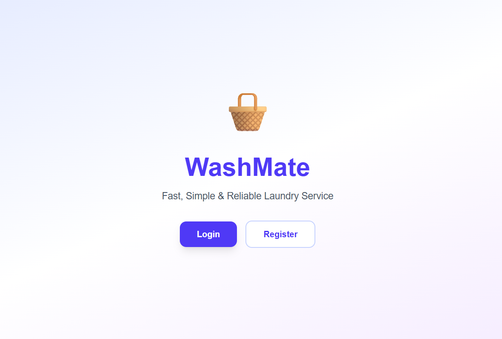

### Customer Dashboard

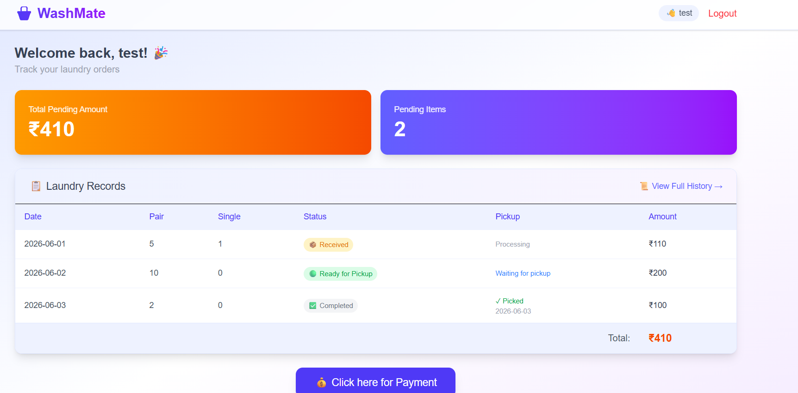


### Transaction History

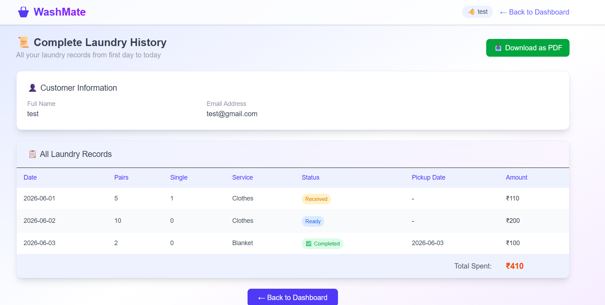

### Payment Page

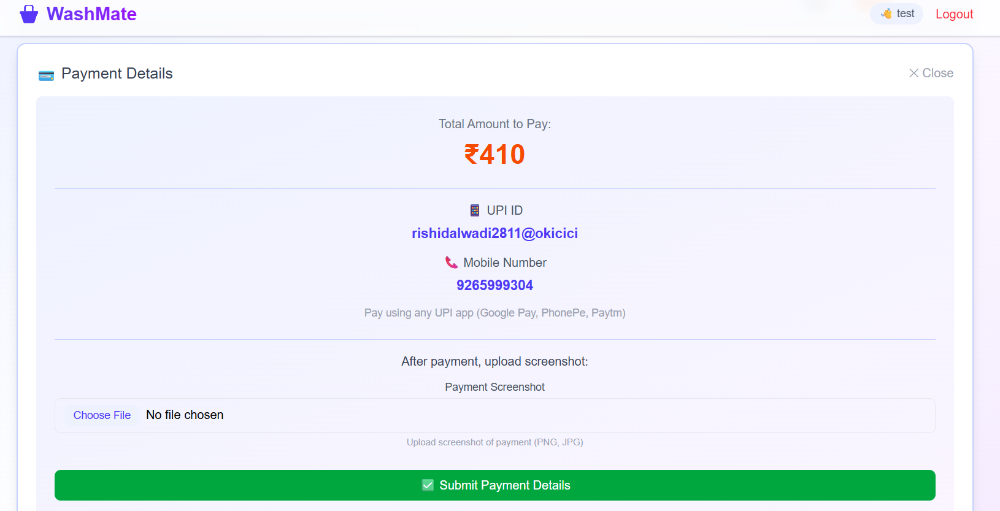

### Payment Verification

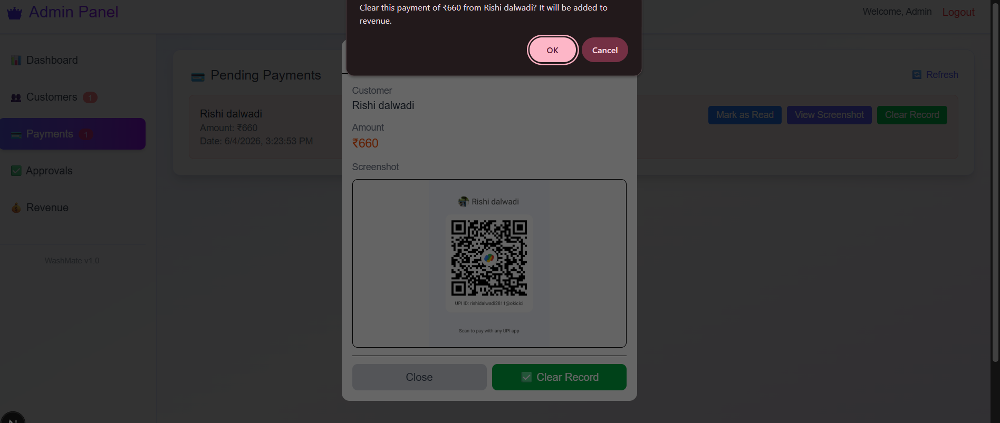


### Admin Dashboard

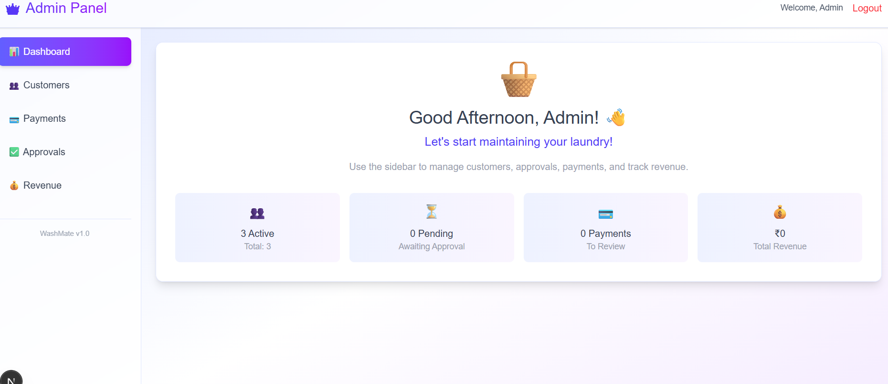

### Customer Management

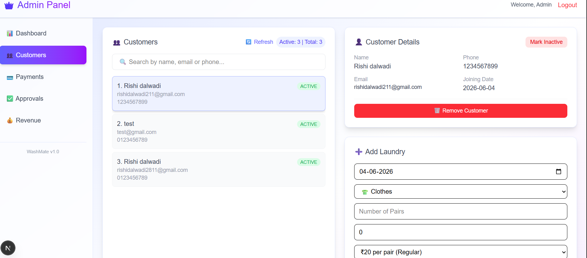

### Laundry Records

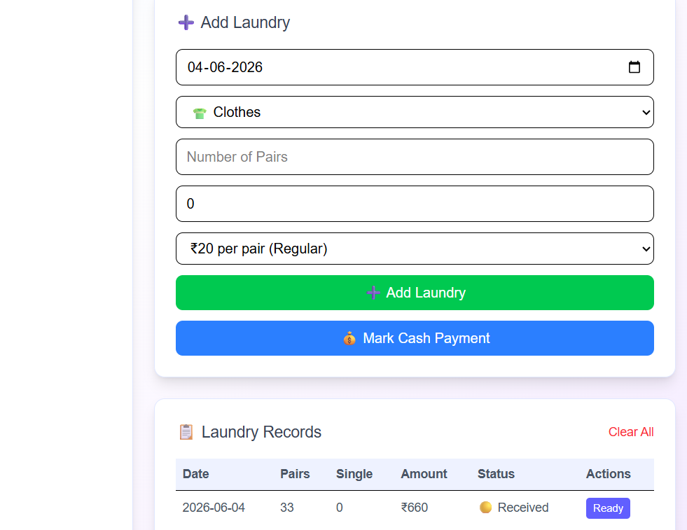

### Customer Approval

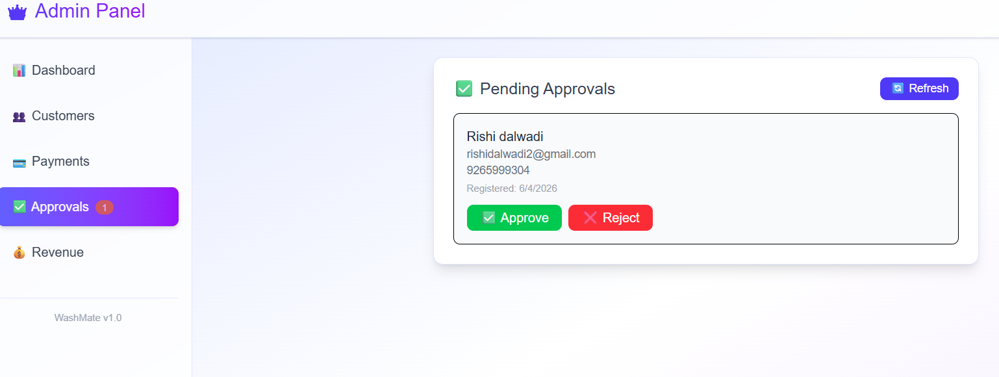

### Revenue Dashboard

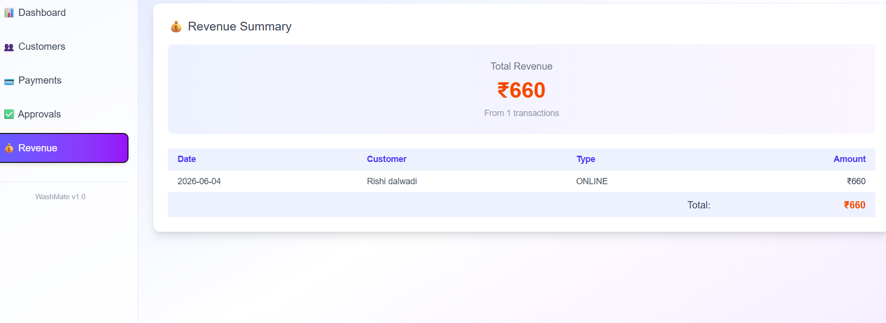

### Email Notifications

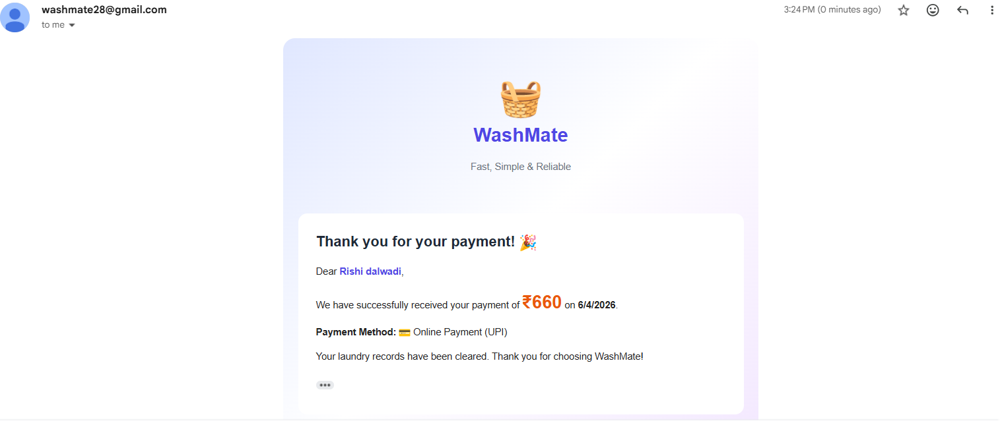

6. Features

 Customer Portal

* Secure Login & Authentication
* Dashboard with Laundry Summary
* Order Status Tracking
* Payment Information
* Payment History
* Profile Management
* Responsive Mobile-Friendly Design

7. Admin Portal

* Customer Management
* Approve Customer Registrations
* Add Laundry Entries
* Update Laundry Status
* Verify Payments
* Revenue Tracking
* Customer Notes
* WhatsApp Broadcast Support


8. Laundry Workflow

Received → Ready → Completed

Customers can monitor the status of their laundry in real time through the dashboard.


9. Payment Management

* Online Payment Support
* Payment Verification Workflow
* Transaction History
* Revenue Tracking
* Customer Billing Records


10. 🛠 Tech Stack

### Frontend

* Next.js
* React
* TypeScript
* Tailwind CSS

### Backend

* Next.js API Routes

### Database

* PostgreSQL

### ORM

* Prisma ORM

### Authentication

* Session-Based Authentication

### Notifications

* Email Integration

### Deployment

* Vercel

10. Local Setup

### Prerequisites

* Node.js 18+
* PostgreSQL Database

### Installation

```bash
git clone https://github.com/rishii28/washmate.git

cd washmate

npm install
```

### Environment Variables

Create a `.env` file:

```env
DATABASE_URL="your_database_url"

EMAIL_USER="your_email@gmail.com"

EMAIL_PASS="your_email_app_password"
```

### Database Setup

```bash
npx prisma migrate dev

npx prisma generate
```

### Run Development Server

```bash
npm run dev
```

Open:

http://localhost:3000

Thankyou. 

